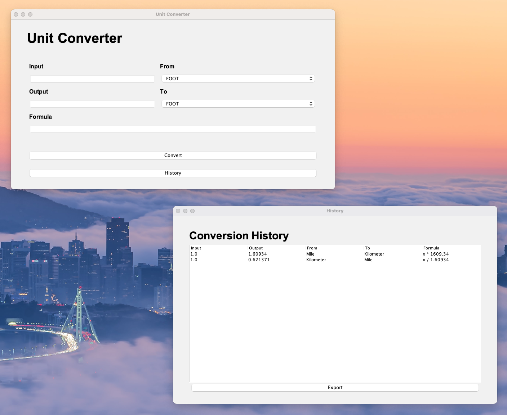

# UnitsConverter

This is a simple units converter program written in Java that allows you to convert different units of measurement. The program is designed to be easy to use and flexible.

The program supports the following units of measurement:

- Length: meters, feet, inches, centimeters, millimeters, kilometers, miles
- Temperature: Celsius, Fahrenheit, Kelvin
- Weight: kilograms, pounds, ounces, grams

## Features

The units converter program includes the following features:

- A user-friendly menu system that allows you to select the conversion type you want.
- Input validation to ensure that only valid numbers are entered.
- Conversion between a wide range of units for each conversion type.
- Error handling to prevent crashes and display helpful error messages.

## Getting Started

To run the program, you will need to have Java installed on your computer. You can download the latest version of Java from the Oracle website.

## License

This program is licensed under the MIT License. See the "LICENSE" file for more information

## Conftributors

This project was realised by the following people and would not have been possible without them:

- Elin
- Jessica
- Lukas
- Maor
- Aleks
